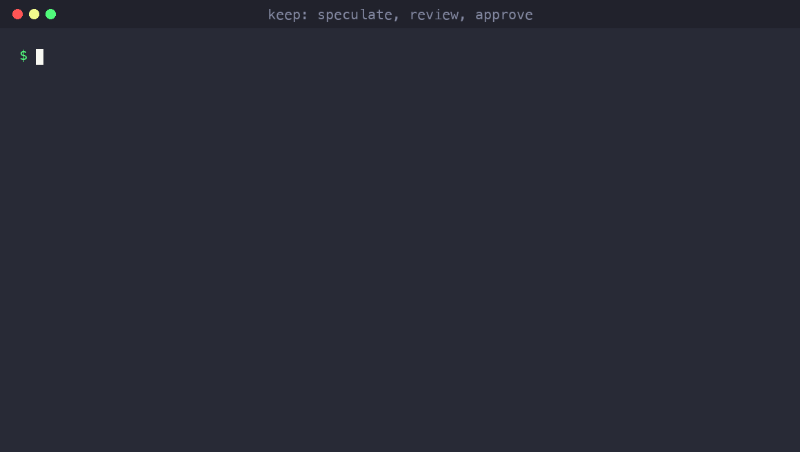
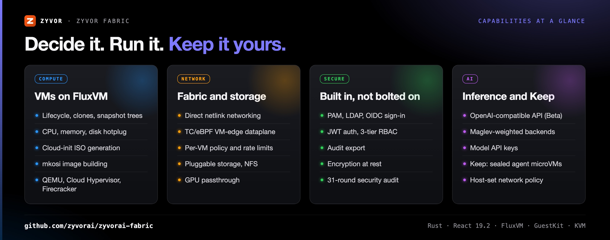
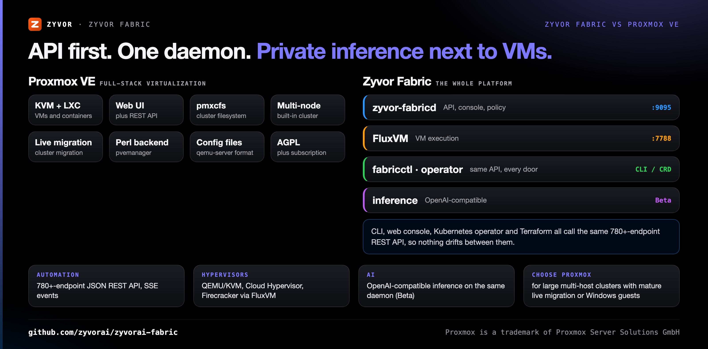
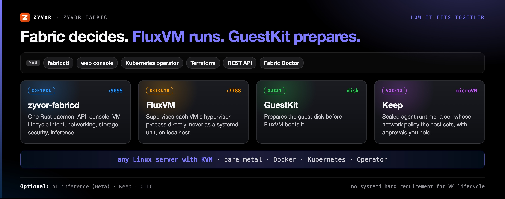

<div align="center">

# Zyvor Fabric

[](https://github.com/zyvorai/zyvorai-fabric/actions/workflows/ci.yml)
[](https://github.com/zyvorai/zyvorai-fabric/actions/workflows/keep.yml)
[](https://github.com/zyvorai/zyvorai-fabric/actions/workflows/agent-runtime.yml)
[](https://github.com/zyvorai/zyvorai-fabric/actions/workflows/ai-workloads.yml)
[](LICENSE)
[](backend/)
[](web/)
[](docs/KUBERNETES.md)
[](https://github.com/zyvorai/zyvor-fluxvm)
[](https://github.com/zyvorai/zyvor-guestkit)

[](https://zyvor.dev/schedule?utm_source=github&utm_medium=fabric&utm_campaign=readme_hero)
[](https://zyvor.dev/poc?utm_source=github&utm_medium=fabric&utm_campaign=readme_hero)
[](#quickstart)


<p align="center">
  
</p>
<p align="center"><sub><b>An agent proposes. A person decides.</b> A real run of the Keep runtime; FluxVM is the CI stub, so no VM boots here. <a href="docs/assets/demos/README.md">How these are made</a></sub></p>

### One daemon. Four front doors.

**Private cloud control plane for Linux.** VMs, networking, storage, security and AI inference from **one daemon**: one ~15MB Rust daemon that deploys in about 5 minutes on any Linux server with KVM, driven the same way from the CLI, the web console, the Kubernetes operator and Terraform.

**780+ REST endpoints** · **53 Rust crates** · **4 front doors, one API** · **92-page web console** · **Built on FluxVM + GuestKit**

[**Quickstart**](#quickstart) · [**Keep**](docs/keep/README.md) · [**AI Workloads**](docs/ai-workloads.md) · [**Deploy**](#deploy) · [**Docs**](docs/index.md) · [**Talk to Zyvor**](https://zyvor.dev)

</div>

---

## What's new

| Release | What landed |
|---|---|
| **Keep** | Speculative execution: `POST /v1/sessions/{id}/speculate` runs a command in an isolated copy of the cell and holds the file changes behind a `changeset` approval. A person's approve applies them on FluxVM; a deny rejects them. The agent cannot approve |
| **Keep** | FluxVM credential grants through `/v1/sessions/{id}/grants`, only for credentials whose Keep limits a grant can keep (no approval, method, path or per-user limits) |
| **FluxVM** | `fluxvm-client` gains fork, snapshot, restore, `?ready=exec`, `Idempotency-Key` on create and delete, guest exec policy, balloon and PSS memory (`fabricctl live-fork`, `fabricctl memory`, `fabricctl balloon`; balloon is Beta), CD-ROM eject and the `vz` backend. Fork, snapshot, restore and idempotency were run against a real FluxVM on KVM; see [the boundary doc](docs/FLUXVM-FABRIC-BOUNDARY.md) for what was and was not |
| **Keep** | Credential secrets from a file or from HashiCorp Vault (`source vault`), with Vault AppRole and Kubernetes login and chart values |
| **Keep** | The runtime rejects policy fields it does not enforce |
| **0.3.0** | `POST /v1/agui`: an AG-UI endpoint over Keep sessions, validated against the official `@ag-ui/core` 1.0.0 schemas; it cannot approve anything |
| **0.3.0** | **Solvor**, a native SwiftUI Mac client for Keep (`integrations/macos-keep`), plus `keepctl init` to scaffold a new use-case pack |
| **0.3.0** | OCR for photos and screenshots inside the cell, six bank operations packs, and more everyday use cases |
| **0.3.0** | `zyvorctl` is now `fabricctl`, and it finds a TLS daemon on `localhost:9095` without `--server` |
| **0.3.0** | Fixed: use-case cells now get a host-applied deny-all policy and fail closed; finished runs delete their cell at once |

Full history: [CHANGELOG.md](CHANGELOG.md).

## Where you can use it

| If you are… | Use it for | Start here |
|---|---|---|
| Building with AI agents | A sealed microVM per agent run, network rules the host sets, approvals you hold | [Keep](docs/keep/README.md) |
| Running a private cloud | VMs, networking, storage and security from one daemon on any Linux server with KVM | [Quickstart](#quickstart) |
| Running Kubernetes | VMs as `VirtualMachine` resources next to your pods | [Kubernetes](docs/KUBERNETES.md) |
| Managing a Mac fleet | Solvor, the native Mac client for Keep | [Solvor](integrations/macos-keep) |
| Wanting inference near your VMs | OpenAI-compatible endpoints on the same daemon (single-cluster Beta) | [AI Workloads](docs/ai-workloads.md) |

## Why Zyvor Fabric

| When this happens… | Zyvor Fabric gives you… |
|---|---|
| The CLI, the console and your Terraform each drift from one another | One REST API with 780+ endpoints behind the CLI, the web console, the Kubernetes operator and Terraform |
| VM lifecycle is tied to libvirt XML or systemd units | FluxVM supervises each VM's hypervisor process directly, and host networking uses direct netlink calls |
| Auth, RBAC and audit are a separate project | PAM/LDAP/OIDC sign-in, JWT auth, 3-tier RBAC, audit export and encryption at rest, built in, with a 31-round security audit report |
| You want private inference next to your VMs, not in someone else's cloud | OpenAI-compatible inference on the same daemon: models, Maglev-weighted backends and API keys (single-cluster Beta) |
| You want to give an AI agent a computer without giving it your network | Keep: a sealed microVM whose network policy the host sets, with approvals you hold |
| Deploying a private cloud is a multi-week project | One daemon on any Linux server with KVM: bare metal, Docker, Kubernetes or Operator only |



## One daemon. Four front doors.

`zyvor-fabricd` gives you VM lifecycle, software-defined networking, pluggable storage, security policy and **OpenAI-compatible AI inference**. The CLI, the web console, the Kubernetes operator and Terraform all talk to the same API, so nothing drifts between them.

Fabric does not implement VM execution itself. That is a deliberate design choice, not a gap: **Fabric decides what should exist; [FluxVM](https://github.com/zyvorai/zyvor-fluxvm) makes it exist; [GuestKit](https://github.com/zyvorai/zyvor-guestkit) prepares the disk.**

> **Naming:** the product is **Zyvor Fabric**; the daemon, unit and paths stay `zyvor-fabricd`. Canonical repo: [zyvorai/fabric](https://github.com/zyvorai/zyvorai-fabric). See [docs/NAMING.md](docs/NAMING.md).

<a id="ai-workloads-beta"></a>

<table>
<tr>
<td valign="top" width="33%">
<b>VMs and networking</b><br>
VM lifecycle, software-defined networking and a TC/eBPF VM-edge dataplane with per-VM policy and rate limits, on top of FluxVM.<br>
<a href="docs/network-fabric-architecture.md">Network Fabric</a>
</td>
<td valign="top" width="33%">
<b>Storage and security</b><br>
Pluggable storage. PAM/LDAP/OIDC sign-in, JWT auth, 3-tier RBAC, audit export and encryption at rest, built in.<br>
<a href="SECURITY.md">Security</a>
</td>
<td valign="top" width="33%">
<b>AI inference <sub>Beta</sub></b><br>
OpenAI-compatible inference on the same daemon: models, Maglev-weighted backends and API keys. Single-cluster Beta, not GA.<br>
<a href="docs/ai-workloads-at-a-glance.md">AI Workloads</a>
</td>
</tr>
<tr>
<td valign="top" width="33%">
<b>Keep</b><br>
An open agent workstation: drop a file, get answers, in a sealed microVM whose network policy the host sets. The docs say exactly what its evidence class does not prove.<br>
<a href="docs/keep/README.md">Keep</a>
</td>
<td valign="top" width="33%">
<b>Kubernetes, Operator, Terraform</b><br>
Run fabricd and FluxVM in a cluster with Helm or manifests; the operator turns <code>VirtualMachine</code> CRs into API calls; a Terraform provider is included.<br>
<a href="docs/KUBERNETES.md">Kubernetes</a>
</td>
<td valign="top" width="33%">
<b>Console and CLI</b><br>
A 92-page web console and <code>fabricctl</code>, both first-class against the same 780+-endpoint REST API.<br>
<a href="docs/web-ui.md">Web console</a>
</td>
</tr>
</table>

---

## Zyvor Fabric vs Proxmox VE



| | **Zyvor Fabric** | **Proxmox VE** |
|---|---|---|
| Hypervisors | QEMU/KVM, Cloud Hypervisor, Firecracker, via [FluxVM](https://github.com/zyvorai/zyvor-fluxvm) | QEMU/KVM plus LXC containers |
| Management layer | FluxVM (systemd-free) + one REST API | pvemanager with a Perl backend |
| Automation | 780+-endpoint JSON REST API, SSE events, Kubernetes operator, Terraform provider included | REST API, `pvesh`, community Terraform providers |
| Cluster model | Single-host or small cluster (multi-host networking available) | Built-in multi-node cluster with its own cluster filesystem (pmxcfs) |
| Live migration | Disk-copy path GA; native FluxVM transport preview; full HA cutover pre-GA | Built-in cluster migration |
| AI inference | OpenAI-compatible inference on the same daemon (Beta) | Not part of the product |
| License | Apache-2.0, in full | AGPL plus an optional subscription |
| **Choose Proxmox VE when** | | You need large multi-host clusters with mature shared-storage live migration today, or first-class Windows guests |

<a id="is-this-for-you"></a>

**Is this for you?** It fits API-first automation, single-host or small-cluster deployments, security-conscious teams, and private inference next to the VMs. Look elsewhere for large multi-host clusters with mature live migration today, a deep libvirt-XML ecosystem, or first-class Windows guests. [The honest version](docs/why-fabric.md#is-this-for-you), the [comparison matrix](docs/guides/decision-support/comparison-matrix.md) and the [FAQ](docs/quick-reference/faq.md).

---

## See it live

<div align="center">


*The console dashboard — fleet health, capability status and live VM metrics at a glance.*

[](docs/keep/README.md)

**Keep it yours.** *[Keep](docs/keep/README.md) is the sealed agent runtime you run, read and take with you. Muse column from its public announcement; evidence class today is `software-test`.*

 

*Solvor, the native Mac client for Keep: pick a use case, then read the result of a run in a sealed cell.*

</div>

---

## How it fits together



- <a id="architecture-fluxvm--guestkit"></a>**Architecture:** how Fabric composes FluxVM and GuestKit — [docs/architecture-fluxvm-guestkit.md](docs/architecture-fluxvm-guestkit.md).
- <a id="zyvor-platform-stack"></a>**Zyvor platform stack:** where Fabric sits among the Zyvor products — [docs/platform-stack.md](docs/platform-stack.md).

---

<a id="quick-start"></a>

## Quickstart

Requires a Linux server with KVM.

```bash
git clone https://github.com/zyvorai/zyvorai-fabric.git && cd fabric
make build && sudo make install
sudo zyvor-fabricd                                   # or: sudo systemctl enable --now zyvor-fabricd
fabricctl create web-01 --image fedora-41 --cpus 2 --memory 4096 --tenant acme
# Web UI → https://localhost:9095   (console at /app)
```

Default ports: **9095** (API + UI) and **7788** (FluxVM on localhost). The full path table, verification commands and multi-tenant notes are in [Getting started](docs/getting-started.md); a laptop dev setup is in [QUICKSTART.md](QUICKSTART.md).

## Platform at a glance

| Metric | Value |
|--------|-------|
| Rust crates | 53 |
| REST endpoints | 780+ (main API) — 824 combined with the OpenStack-compatibility layer |
| LOC | ~87K (60K Rust + 27K TS) |
| Web stack | React 19.2 · Vite · Tailwind |
| Interfaces | 4 (CLI, Web, Operator, Terraform) + Fabric Doctor |
| Web pages | 92 (87 console + 5 marketing) |
| Security | 31-round audit, 194 issues found and fixed, 0 outstanding ([report](docs/SECURITY_AUDIT_REPORT.md)) |
| Deploy modes | Bare metal · Docker · Kubernetes · Operator |

All figures above are counted directly from source (route definitions, router config, crate manifest, audit report) — see [docs/PRODUCT_OVERVIEW.md](docs/PRODUCT_OVERVIEW.md) for the methodology.

## Deploy

Four first-class ways to run Fabric. Pick one; the full guide is [docs/deploy.md](docs/deploy.md).

- <a id="bare-metal-systemd--easiest-path"></a>**Bare metal (systemd), easiest path:** `./scripts/ship USER@HOST` ships FluxVM and Fabric in one command. [Details](docs/deploy.md#bare-metal-systemd--easiest-path).
- **Docker / Podman:** `make docker-up`, then `http://localhost:9095`. [Details](docs/DOCKER.md).
- <a id="run-on-kubernetes"></a>**Kubernetes:** `./scripts/deploy k8s USER@HOST` for a k3s lab, or Helm from `charts/zyvor-fabric`. [Details](docs/deploy.md#run-on-kubernetes) and [docs/KUBERNETES.md](docs/KUBERNETES.md).
- **Operator only:** CRDs that drive an already-running fabricd, from [`operator/`](operator/).

## Documentation

| Topic | Doc |
|---|---|
| Every document, by area | [docs/index.md](docs/index.md) · [docs/documentation-map.md](docs/documentation-map.md) |
| Getting started and deploy | [docs/getting-started.md](docs/getting-started.md) · [docs/deploy.md](docs/deploy.md) · [QUICKSTART.md](QUICKSTART.md) |
| Positioning, overview and every feature | [docs/POSITIONING.md](docs/POSITIONING.md) · [docs/PRODUCT_OVERVIEW.md](docs/PRODUCT_OVERVIEW.md) · [FEATURES.md](FEATURES.md) |
| Architecture | [docs/architecture.md](docs/architecture.md) · [docs/architecture-fluxvm-guestkit.md](docs/architecture-fluxvm-guestkit.md) |
| REST API, OIDC/SSO and networking | [docs/api.md](docs/api.md) · [docs/oidc.md](docs/oidc.md) · [docs/networking.md](docs/networking.md) |
| AI Workloads (Beta) | [docs/ai-workloads.md](docs/ai-workloads.md) · [Tutorial 15](docs/tutorials/15-ai-workloads.md) |
| Keep (open agent workstation) | [docs/keep/README.md](docs/keep/README.md) · [docs/keep/at-a-glance.md](docs/keep/at-a-glance.md) |
| Tutorials and user manuals | [docs/tutorials/README.md](docs/tutorials/README.md) · [docs/user/README.md](docs/user/README.md) |

## Contributing

Contributions are welcome. See **[CONTRIBUTING.md](CONTRIBUTING.md)** for the development setup, code style and PR process.

```bash
make build          # backend + web
make test           # Rust + web tests
make lint && make fmt
```

`docs/` and this README are authoritative; historical build summaries in the repo root are snapshots.

---

## Maturity

| Area | Status (from the repo's own docs) |
|---|---|
| VM lifecycle, networking, storage, security, CLI, console, operator, Terraform | Shipped; see [FEATURES.md](FEATURES.md) |
| Live migration | Disk-copy path GA; native FluxVM transport **preview**; full HA cutover **pre-GA** ([comparison matrix](docs/guides/decision-support/comparison-matrix.md)) |
| AI Workloads | Single-cluster **Beta**; multi-site HA store stays **Preview**; **not GA** ([at a glance](docs/ai-workloads-at-a-glance.md)) |
| Keep | Evidence class `software-test`; Keep 0.2 hardware still gated; the Kubernetes chart is rendered and schema-checked but never installed in a cluster ([status](docs/keep/STATUS.md)) |

---

## Part of the Zyvor stack

| Product | Role next to Zyvor Fabric |
|---|---|
| **Zyvor Fabric** | Private cloud control plane: VMs, networking, storage, security, inference |
| **[FluxVM](https://github.com/zyvorai/zyvor-fluxvm)** | The VM engine Fabric is built on: makes what Fabric decides exist |
| **[GuestKit](https://github.com/zyvorai/zyvor-guestkit)** | Offline VM disk inspection, repair and customization; prepares the disk |
| **[hyper2kvm](https://github.com/zyvorai/hyper2kvm)** | Multi-cloud VM migration, listed next to Fabric in the [platform stack](docs/platform-stack.md) |

→ [zyvor.dev](https://zyvor.dev)

---

## License and support

Zyvor Fabric is **free and open source** under the [Apache License, Version 2.0](LICENSE), in full — there is no dual-licensing or separately-licensed core component. You may use, modify, and run it for personal, lab, and commercial production use at no charge, subject to Apache-2.0 (preserve notices / NOTICE where required). See [NOTICE](NOTICE).

**Zyvor Enterprise** adds what production teams ask for: supported releases, deployment and upgrade guidance, priority incident triage, a named technical contact and 24x7 critical intake. Plans and terms: [docs/SUBSCRIPTION-MODEL.md](docs/SUBSCRIPTION-MODEL.md) · [Pricing](https://zyvor.dev/pricing?utm_source=github&utm_medium=fabric&utm_campaign=readme_license) · [sales@zyvor.dev](mailto:sales@zyvor.dev).

Report vulnerabilities per [SECURITY.md](SECURITY.md).

---

<div align="center">

### Run your private cloud from one daemon

[](https://zyvor.dev/schedule?utm_source=github&utm_medium=fabric&utm_campaign=readme_footer)
[](https://zyvor.dev/poc?utm_source=github&utm_medium=fabric&utm_campaign=readme_footer)
[](https://zyvor.dev/pricing?utm_source=github&utm_medium=fabric&utm_campaign=readme_footer)
[](mailto:sales@zyvor.dev?subject=Zyvor%20Fabric)
[](https://github.com/zyvorai/zyvorai-fabric)

</div>
